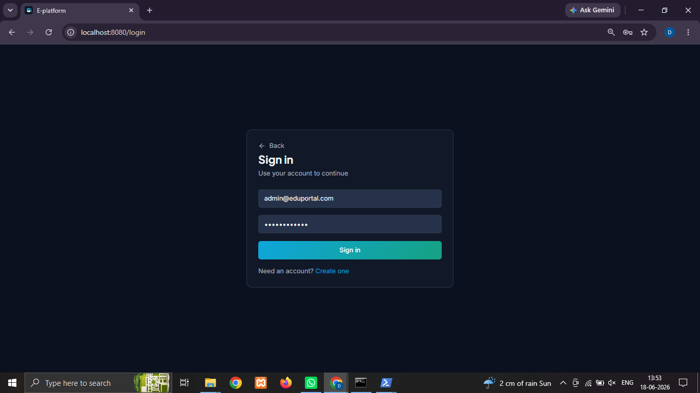
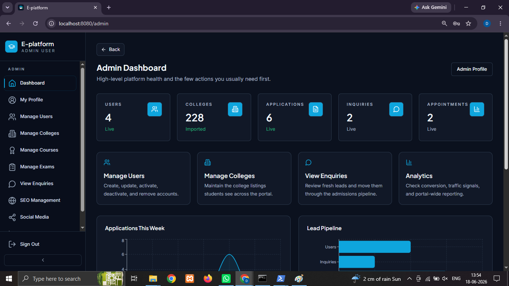
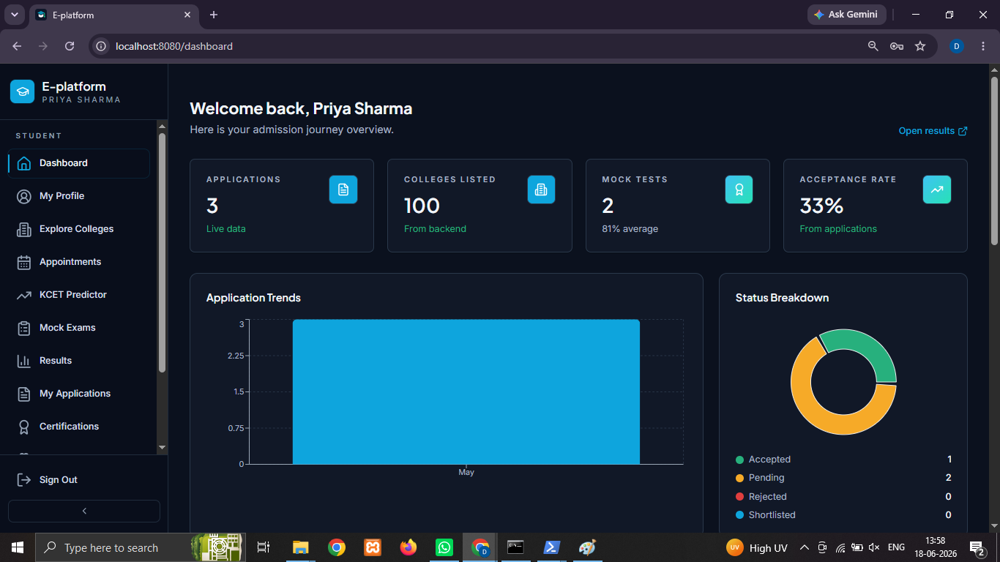
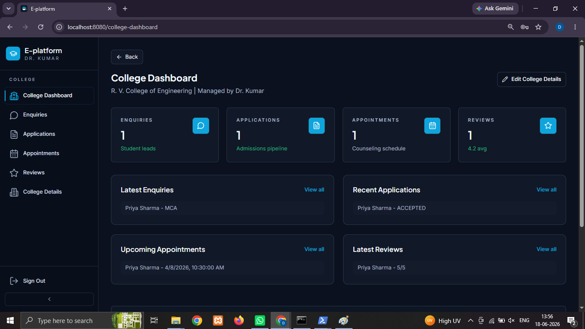

# E-Platform College Management System

A full-stack College Management System built using React, Node.js, Express.js, PostgreSQL, and Prisma ORM. The platform enables administrators to manage students, courses, users, admissions, and academic operations through a centralized dashboard.

## Features

* User Authentication and Authorization
* Role-Based Access Control
* Student Management
* College Management
* Course Management
* Application Management
* Examination Management
* Admin Dashboard
* PostgreSQL Database Integration
* RESTful API Architecture
* Responsive User Interface

## Tech Stack

### Frontend

* React
* Vite
* Tailwind CSS
* TypeScript

### Backend

* Node.js
* Express.js
* Prisma ORM

### Database

* PostgreSQL

## Project Structure

```text
E-Platform-college-management-system/
│
├── frontend/       # React Application
├── backend/        # Express API Server
├── Screenshots/    # Project Screenshots
├── README.md
└── .gitignore
```

## Getting Started

### Prerequisites

* Node.js
* PostgreSQL
* npm

### Frontend Setup

Create a `.env` file from `.env.example` and run:

```bash
npm install
npm run dev
```

### Backend Setup

Create a `.env` file from `.env.example` and run:

```bash
npm install
npx prisma generate
npm run dev
```

### Optional Development Script

A PowerShell script (`start-dev.ps1`) is included to automatically start PostgreSQL, backend, and frontend services.

You may need to update the PostgreSQL installation path inside the script according to your local setup.

## Screenshots

### Login Page



### Admin Dashboard



### Student Dashboard



### College Dashboard



## Future Enhancements

* Attendance Management
* Notification System
* Report Generation
* Analytics Dashboard
* Cloud Deployment

## Author

Deepu G

GitHub: https://github.com/deepu-164
